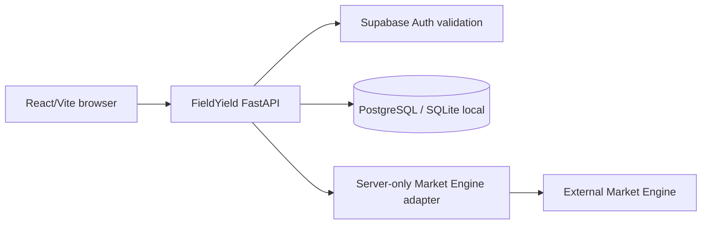

# FieldYield

FieldYield is a React/Vite football-asset trading frontend backed by a FastAPI service and a SQL database. It is a V1 deployment foundation for authenticated users, profiles, wallets, real catalog data, market orders, portfolios, squads, watchlists, notifications, and administrator controls. It is not a claim that a live financial market is ready.

## Contents

- [Status and authority](#status-and-authority)
- [Architecture](#architecture)
- [Repository structure](#repository-structure)
- [Local setup](#local-setup)
- [Environment variables](#environment-variables)
- [Frontend](#frontend)
- [Google OAuth](#google-oauth)
- [Backend API](#backend-api)
- [Data model and migrations](#data-model-and-migrations)
- [Signup bonus](#signup-bonus)
- [Catalog and price ingestion](#catalog-and-price-ingestion)
- [Market Engine contract](#market-engine-contract)
- [Administration](#administration)
- [Deployment](#deployment)
- [Validation](#validation)
- [Known limitations and external blockers](#known-limitations-and-external-blockers)

## Status and authority

Supabase Auth project `uewpyfwnuiqjzxahmesz` is the production identity authority when `AUTH_PROVIDER=supabase` and the server has `SUPABASE_URL` plus `SUPABASE_ANON_KEY`. Supabase bearer tokens are validated server-side and must map to exactly one local `users.auth_provider_id`. The local signed JWT endpoints remain only as an explicitly configured local/test compatibility mode (`AUTH_PROVIDER=local`); they must not be enabled on Render.

The browser calls only the FieldYield API. It never receives service-role or Market Engine credentials. The FieldYield database is authoritative for local profile, wallet, holdings, and order records. Startup never seeds players, prices, activity, dividends, or balances.

## Architecture


```mermaid
flowchart LR
  Browser[React/Vite browser] --> API[FieldYield FastAPI]
  API --> Auth[Supabase Auth validation]
  API --> DB[(PostgreSQL / SQLite local)]
  API --> ME[Server-only Market Engine adapter]
  ME --> External[External Market Engine]
```

Alembic is the only migration authority. Supabase SQL migrations are not maintained in parallel. On PostgreSQL, migration `v9_supabase_rls_guard` enables deny-by-default RLS for direct `anon`/`authenticated` access; the FastAPI database role remains the application authority.

## Repository structure

```text
src/
  app/                 application shell, auth restoration, navigation
  components/          layout, shared UI, icons, dialogs
  features/            auth, assets, dashboard, markets, portfolio, squad,
                       search, settings, trading, watchlist, notifications
  data/fieldyield.ts   shared domain types only
  lib/api.ts           typed browser-to-FieldYield API client
  lib/supabase.ts      optional public Supabase Auth client
  styles.css           scoped Retro-Glass responsive styles
backend/
  app/main.py          FastAPI app, CORS, health, domain/admin routes
  app/models.py        SQLAlchemy persistence model
  app/schemas.py       Pydantic validation and response contracts
  app/services.py      auth, wallet, signup bonus, and local order services
  app/api/deps.py      bearer-token, Supabase identity, and admin dependencies
  app/integrations/    isolated Market Engine adapter
  app/core/            settings, database, security, Redis/Celery scaffolding
  alembic/versions/    ordered schema migrations (latest: v10)
  tests/               isolated API, concurrency, and adapter-contract tests
docs/market-engine-contract.md  external integration contract and blockers
render.yaml            Render API/Redis/PostgreSQL configuration
vercel.json            Vercel frontend build configuration
```

## Local setup

Use Node 20.19+ (Vite 7), Python 3.12+, and PostgreSQL for production. SQLite is sufficient for local API tests.

```bash
npm install
cp .env.example .env.local
npm run dev

cd backend
python3 -m venv .venv
source .venv/bin/activate
pip install -r requirements.txt
cp .env.example .env
alembic upgrade head
uvicorn app.main:app --reload
```

For local JWT tests set `AUTH_PROVIDER=local`. For Supabase testing set
`AUTH_PROVIDER=supabase`, configure the Supabase URL/anon key, and set the
frontend public variables. Never put a service-role key in `.env.local`.

## Environment variables

Frontend build-time variables (safe to expose):

| Variable | Purpose |
| --- | --- |
| `VITE_API_BASE_URL` | FieldYield API origin, without a trailing slash. |
| `VITE_SUPABASE_URL` | Supabase Auth project URL. |
| `VITE_SUPABASE_ANON_KEY` | Supabase public anon key only. |
| `VITE_SITE_URL` | Exact browser origin used for OAuth redirects; configure separately for local, preview, and production. |

Backend server-only variables:

| Variable | Purpose |
| --- | --- |
| `DATABASE_URL` | SQLAlchemy URL; PostgreSQL is converted to `postgresql+psycopg`. |
| `SECRET_KEY` | Local JWT signing key; use a generated value even when Supabase is primary. |
| `AUTH_PROVIDER` | `supabase` for production, `local` only for isolated local/test use. |
| `FRONTEND_URL` | Must exactly equal `https://field-yield.vercel.app`; strict CORS origin. |
| `ACCESS_TOKEN_EXPIRE_MINUTES` | Local JWT lifetime. |
| `SIGNUP_BONUS_ENABLED` | Enables the one-time server-side grant. |
| `SIGNUP_BONUS_GOLD`, `SIGNUP_BONUS_SILVER` | Server-controlled integer amounts. |
| `SUPABASE_URL`, `SUPABASE_ANON_KEY` | Server-side Supabase Auth validation and health checks. Required in Supabase mode. |
| `SUPABASE_SERVICE_ROLE_KEY` | Reserved server-only administrative integration; never sent to the browser. |
| `ADMIN_EMAILS` | Comma-separated bootstrap emails; no personal values are committed. |
| `MARKET_ENGINE_BASE_URL`, `MARKET_ENGINE_API_KEY` | Optional server-only external adapter configuration. |
| `MARKET_ENGINE_TIMEOUT_MS`, `MARKET_ENGINE_VERSION` | Adapter timeout and compatibility header. |
| `REDIS_URL` | Optional acceleration infrastructure; SQL remains financial truth. |
| `ALLOW_TEST_CREDIT` | Must be `false` in production; test-only legacy credit route. |

## Frontend

`src/app/App.tsx` restores the Supabase or local token, loads the authenticated
profile, wallet, summary, notifications, watchlist, and backend market catalog,
then renders the existing dock/mobile navigation. Empty backend responses show
empty states rather than fabricated players, holdings, charts, activity, or
balances. Trading dialogs submit authenticated market orders with an
idempotency key and display the authoritative response. Shared Retro-Glass UI,
responsive layouts, theme persistence, reduced motion, search, notifications,
and profile settings remain in the frontend.

## Google OAuth

FieldYield is a client-only Vite SPA using Supabase's implicit OAuth flow. The
browser calls `supabase.auth.signInWithOAuth({ provider: 'google' })`; Google
secrets remain inside Supabase Auth and never enter the bundle. Supabase parses
the returned session hash, persists the session, and the existing backend sync
endpoint creates the local profile, wallet, and one-time signup bonus.

Supabase project settings:

1. Enable Google under **Authentication → Providers → Google**.
2. Set the Google provider callback URL exactly to
   `https://uewpyfwnuiqjzxahmesz.supabase.co/auth/v1/callback`.
3. Configure the Supabase Site URL as `https://field-yield.vercel.app`.
4. Add only approved local/preview redirect URLs in Supabase Auth URL configuration.

Google Cloud OAuth settings must include the production origin
`https://field-yield.vercel.app`, the local origin used during development (for
example `http://localhost:5173`), and the exact Supabase callback above. Use
only `openid email profile`; no Google API scopes are requested. Configure and
publish the consent screen, or explicitly add verification accounts while the
application remains in testing.

Set `VITE_SITE_URL` per environment:

```text
local:      http://localhost:5173
preview:    https://<approved-vercel-preview-domain>
production: https://field-yield.vercel.app
```

If Google returns a new Supabase identity, the application asks for date of
birth and username before `/api/v1/auth/supabase-sync` creates the local record.
Existing local records are not merged solely by matching email. Accounts must
be linked through Supabase's supported identity-linking flow or handled through
an explicit account migration; Google metadata cannot assign roles or bypass
suspension. A linked user's existing role, wallet, bonus state, and suspension
status are preserved.

For redirect failures, verify the Google Cloud authorized redirect URI,
Supabase's provider callback, and the FieldYield `VITE_SITE_URL`/Site URL all
match exactly. Do not add wildcard production redirects. OAuth query and hash
parameters are removed after successful session restoration or a handled
provider error.

## Backend API

Public:

- `GET /health` — database, Supabase Auth, auth-provider, and optional Market Engine readiness.
- `GET /api/v1/market-engine/health` — adapter readiness without exposing credentials.
- `POST /api/v1/auth/supabase-sync` — validates a Supabase session and creates/links the local record idempotently.
- `POST /api/v1/auth/register`, `POST /api/v1/auth/login`, `POST /api/v1/auth/token` — available only in explicit local auth mode.
- `GET /api/v1/market/prices` — bounded active catalog and current prices.

Authenticated:

- `GET/PATCH /api/v1/users/me`, `GET /api/v1/users/me/profile`, `GET /api/v1/users/me/summary`
- `POST /api/v1/users/verify-age`
- `GET /api/v1/wallet`, `GET /api/v1/wallet/ledger`
- `POST /api/v1/trading/orders/market-buy`, `POST /api/v1/trading/orders/market-sell`, `GET /api/v1/trading/orders`
- `GET /api/v1/portfolio`, `GET /api/v1/portfolio/holdings`
- `GET /api/v1/squad`, `POST /api/v1/squad/promote`, `POST /api/v1/squad/demote`
- `GET/POST/DELETE /api/v1/watchlists...`
- `GET /api/v1/notifications`, `POST /api/v1/notifications/{id}/read`

Administrator-only:

- `GET /api/v1/admin/users` — bounded search/list with wallet and bonus status.
- `PATCH /api/v1/admin/users/{id}/status` — suspend/restore with an audit record.
- `GET /api/v1/admin/audit` — bounded audit history.
- `POST /api/v1/admin/catalog/import` — validated atomic catalog/price upsert with source metadata.

Private dependencies derive identity from the verified bearer token, never a
client-supplied user ID. Errors have structured JSON and strict CORS headers.

## Data model and migrations

The compact model contains `users`, `wallets`, `wallet_transactions`, `players`,
`market_prices`, `orders`, `order_matches`, `holdings`, `active_squad`,
`watchlists`, `notifications`, `signup_bonus_grants`, and `audit_logs`. Unique
constraints protect emails/usernames, Supabase identity IDs, idempotency keys,
watchlists, holdings, and the one-row-per-user signup grant. `market_prices`
stores `source` and `updated_at`, not generated chart data or duplicated player
metadata.

Apply the ordered chain with:

```bash
cd backend
alembic upgrade head
```

Migrations preserve existing balances and trades. The latest migrations add
market-price source metadata, PostgreSQL RLS protection, and verified
auth-provider metadata. No Supabase CLI
migration chain is maintained; a live Supabase migration run must be performed
by the deployment operator against the intended project after reviewing the
Alembic SQL.

## Signup bonus

Registration/sync creates the user and wallet and grants configured Gold/Silver
inside one SQL transaction. `signup_bonus_grants.user_id` and its idempotency key
are unique; wallet ledger rows use unique keys as well. The client cannot choose
the amount or re-run the grant. Existing users are not backfilled. The frontend
reads the resulting wallet and ledger from the API.

## Catalog and price ingestion

Production startup deliberately does not seed catalog data. An administrator
imports real records through `POST /api/v1/admin/catalog/import`. The endpoint
limits batches to 500 records, rejects duplicate symbols, validates bounded
text and positive bid/ask values, atomically upserts `players` and
`market_prices`, stores the provider/source label, and writes one audit record.

```bash
curl -X POST "$API/api/v1/admin/catalog/import" \
  -H "Authorization: Bearer $ADMIN_TOKEN" -H "Content-Type: application/json" \
  -d '{"source":"provider-2026-07-26","records":[{"symbol":"HA9","name":"Example Player","league":"EPL","club":"Example FC","bid":98.50,"ask":100.00,"active":true}]}'
```

Use real provider data in deployment; the example is intentionally not bundled
as production seed data. Automated provider ingestion is not enabled yet.

## Market Engine contract

The read-only audit of `divyansh953/Market-Engine-` found FastAPI endpoints
`/health/live`, `/health/ready`, `POST /v1/orders`,
`DELETE /v1/orders/{order_id}?user_id=...`, bootstrap, and snapshot calls. The
service owns its own SQLite wallet/position store and does not currently expose
FieldYield catalog sync, wallet reconciliation, or a signed service identity.

`backend/app/integrations/market_engine.py` is a server-only, timeout-bounded
adapter with optional bearer credentials and version headers. Health, submit,
and cancellation are explicit primitives; mutation requests are not blindly
retried. The full required contract, error shape, idempotency rules, and
reconciliation requirements are in [`docs/market-engine-contract.md`](docs/market-engine-contract.md).
Until that contract is delivered and verified, local SQL order settlement is
authoritative and external live settlement remains disabled.

## Administration

Set `ADMIN_EMAILS` server-side before registering a bootstrap administrator, or
promote a role through a controlled database operation. Admin dependencies check
the database role/bootstrap email on the server. User status changes, catalog
imports, and other sensitive operations are audited. The Supabase service-role
key is never exposed to the browser.

## Deployment

Vercel hosts only the Vite frontend (`npm run build`, output `dist`). Configure
`VITE_API_BASE_URL`, `VITE_SUPABASE_URL`, and `VITE_SUPABASE_ANON_KEY` in the
Vercel production/preview environments. Add the production callback origin
`https://field-yield.vercel.app` and the selected preview/local callback URLs
to Supabase Auth redirect settings. Do not add server-only keys to Vercel.

Render deploys the FastAPI container from `backend/Dockerfile`; `start.sh` runs
`alembic upgrade head` and then Uvicorn. Configure `AUTH_PROVIDER=supabase`,
`FRONTEND_URL`, `DATABASE_URL`, Supabase server values, signup-bonus values,
`ADMIN_EMAILS`, and any external adapter values. Verify `/health` before opening
the frontend. This repository was not deployed from the current environment.

## Validation

```bash
node --version                 # must be >=20.19.0
npm install
npm run typecheck
npm run build
npm audit --audit-level=high
cd backend && .venv/bin/pytest -q
DATABASE_URL=sqlite:////tmp/fieldyield-migration.db FRONTEND_URL=https://field-yield.vercel.app .venv/bin/alembic upgrade head
git diff --check
```

The local checks run for this change include TypeScript, production build,
dependency audit, full backend tests, clean SQLite migration upgrades, CORS,
signup-bonus idempotency, admin authorization, and mocked Market Engine adapter
contract tests. Supabase CLI credentials, a live Supabase PostgreSQL instance,
Vercel, Render, and production Market Engine credentials were unavailable, so
those deployment checks remain operator-owned.

## Known limitations and external blockers

- Supabase is the intended production authority, but live Auth/session and database verification still require the configured Supabase project credentials.
- Google provider enablement, Google Cloud consent publishing, and a real OAuth round trip still require manual Supabase/Google Cloud/Vercel configuration and were not verified from this environment.
- A production catalog must be loaded through the admin import boundary or a future provider worker; an empty catalog is intentional.
- The external Market Engine owner must provide catalog, price, wallet-reconciliation, service-authentication, and event/replay contracts before external settlement can be enabled.
- No push notification provider, scheduled market worker, realtime order stream, persistent limit-order UI, or automated sports ingestion is enabled.
- There is no frontend ESLint script in `package.json`.
- No Vercel/Render deployment or production migration was executed here, and no commit or push was made.

These limitations are explicit so deployment does not present simulated prices,
balances, catalog entries, or trading success as real platform state.
