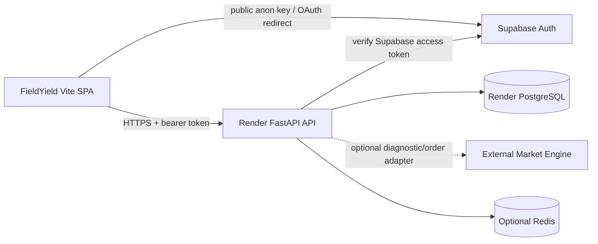

# FieldYield production architecture

This directory documents the implemented FieldYield V1 system: a Vite browser
application, a FastAPI API, a SQL database, Supabase Auth, and an optional
server-side boundary to the separately maintained Market Engine. It is an
operational reference, not a product roadmap.

> **Source of truth:** the checked-in source code, Alembic migrations, deployed
> configuration, and passing tests outrank this documentation. Update these
> pages when those sources change.

## System boundary

The production frontend is `https://field-yield.vercel.app`. Its API base URL
is `https://fieldyield-api.onrender.com` in the deployed build. The browser
does not call the Market Engine and never receives service credentials.

## Audit matrix

| Area | Actual implementation | Source files | Production status | Risk or missing piece |
| --- | --- | --- | --- | --- |
| Frontend | React 19/Vite SPA with feature pages, responsive Retro-Glass UI, Supabase session restoration, typed `fetch` client | `src/main.tsx`, `src/app/App.tsx`, `src/features/`, `src/lib/api.ts` | Vercel deployment is live and build-verified | No shared query cache; screens fetch their own bounded resources |
| Backend | FastAPI routes for auth sync, profiles, wallets, local SQL market orders, portfolios, squads, watchlists, notifications, admin operations | `backend/app/main.py`, `backend/app/services.py`, `backend/app/api/deps.py` | Render health currently reports database and Supabase `ok` | Local JWT endpoints remain only for explicit local/test mode |
| Auth | Supabase Auth is production authority; local JWT is a compatibility mode selected by `AUTH_PROVIDER=local` | `src/lib/supabase.ts`, `src/features/auth/AuthPage.tsx`, `backend/app/api/deps.py` | Supabase mode is configured on the current Render service | Google provider and redirect allowlists are external configuration |
| Database | SQLAlchemy models with PostgreSQL in Render and SQLite for tests; Alembic migrations through `v10_auth_provider` | `backend/app/models.py`, `backend/alembic/versions/` | Migration chain validates on a safe SQLite database | Production backup/rollback execution is an operator responsibility |
| Market Engine | Server-only adapter with bounded HTTP calls and an audited contract document | `backend/app/integrations/market_engine.py`, `docs/market-engine-contract.md` | Current health is `not_configured`; local SQL remains authoritative | External service lacks catalog/price sync and reconciliation contract |
| Deployment | Vercel static frontend; Render Docker FastAPI service, PostgreSQL, and optional Redis | `vercel.json`, `render.yaml`, `backend/Dockerfile`, `backend/start.sh` | Vercel and Render deployments are live; backend health is reachable | Render `MARKET_ENGINE_*` is intentionally unset until contract agreement |

## Documentation map

- [Frontend flow](./frontend-flow.md) — browser entry point, auth, data loading, and UI failure behavior.
- [Backend flow](./backend-flow.md) — FastAPI lifecycle, dependencies, endpoints, authorization, and integrations.
- [Database flow](./database-flow.md) — models, migration chain, constraints, transactions, and data integrity.
- [Deployment and operations](./deployment-and-operations.md) — Vercel, Render, Supabase, variables, smoke checks, and incident handling.
- [Known issues and fixes](./known-issues-and-fixes.md) — prioritized evidence-based backlog with owners and validation.
- [Market Engine contract](../market-engine-contract.md) — the external service boundary and unavailable capabilities.

## Entry points

For local development, start from the root [README](../../README.md). The
frontend runs with Vite; the API runs from `backend/` after migrations. For a
production rollout, follow [deployment and operations](./deployment-and-operations.md)
and use the smoke-test checklist before enabling user-facing trading.
