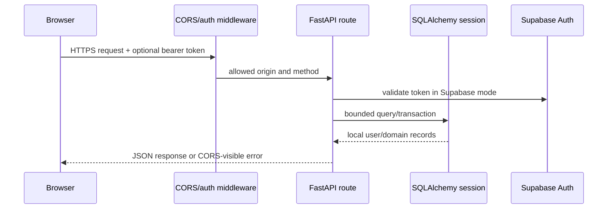

# Backend flow

## Startup and request lifecycle

`backend/app/main.py` creates the FastAPI application. Render invokes
`backend/start.sh`, which runs `alembic upgrade head` and then starts
`uvicorn app.main:app --host 0.0.0.0 --port ${PORT:-8000}`. The API no longer
creates tables from SQLAlchemy metadata at startup; Alembic is the only
production schema authority.

The production configuration registers strict CORS for exactly
`https://field-yield.vercel.app`, disallows browser credentials, and permits
only the required methods and headers. Development origins are explicit. A
request logging middleware records request ID, method, path, status, and timing
through the `fieldyield.api` logger. HTTP and unexpected exceptions are
serialized as JSON and include the production CORS headers so browser clients
can see real 401/403/5xx responses.

The database session is supplied by `backend/app/core/database.py` and is
closed after each request. PostgreSQL URLs are adapted to the psycopg SQLAlchemy
driver; SQLite is used by local tests.

## Configuration and health

`backend/app/core/config.py` loads `.env` values through Pydantic Settings.
`CORS_ORIGINS` is validated against the single production origin. `AUTH_PROVIDER`
is either `supabase` or `local`; it never silently falls back. Supabase mode
fails closed when its URL/anon key is absent.

`GET /health/live` checks process liveness without dependencies.
`GET /health/ready` checks the SQL connection, checks Supabase Auth when required,
and checks the optional Market Engine when settlement is enabled. It returns
HTTP 503 unless every required dependency is ready. The backward-compatible
`GET /health` returns the component payload without acting as the deployment
probe. The `supabase` and `market_engine` fields
separately report `ok`, `unavailable`, or `not_configured`; the latter is
intentional for the optional external integration. The currently deployed
endpoint has been observed returning database/Supabase `ok` and
Market Engine `not_configured`. `market_engine_trading_enabled` must remain
`false` until sandbox contract tests cover order acceptance, fills, duplicate
requests, cancellation, and FieldYield-side settlement.

`GET /api/v1/market-engine/health` reports the adapter state without exposing
credentials and returns 503 when a configured engine is unavailable.

## Authentication and authorization

`backend/app/api/deps.py` supplies these dependencies:

- `current_user` requires a bearer token. In Supabase mode, RS256/ES256 tokens
  use cached JWKS verification with explicit algorithm, issuer, audience,
  expiration, issued-at, and subject requirements. An unknown key ID triggers
  one bounded refresh. Legacy HS256 Supabase projects use the provider user
  endpoint with a short timeout and bounded digest-keyed cache; local JWT
  verification is never a production fallback. In local mode only, HS256
  validates the same required claims against a separate issuer/audience.
- `verified_user` additionally requires `age_verified`.
- `admin_user` requires the persisted `role=admin` or a server-configured
  `ADMIN_EMAILS` address. Client role fields are never trusted.

Inactive/suspended users receive 403 before private route logic. Missing,
expired, invalid, or unlinked tokens receive 401. A Google identity cannot
create an admin role or bypass a suspension.

## Request flows

| Flow | Route/service | Validation and side effects |
| --- | --- | --- |
| Local registration | `POST /api/v1/auth/register` → `services.register` | Email/username uniqueness, age >= 18, password hashing, wallet creation, one-time bonus transaction; disabled in Supabase mode |
| Supabase sync | `POST /api/v1/auth/supabase-sync` → `sync_supabase_user` | Token identity is revalidated; provider ID is unique; email-only merging is rejected; returns `profile_incomplete` with `required_fields` when DOB is missing; profile/wallet/bonus creation is idempotent |
| Profile | `GET/PATCH /api/v1/users/me` | User comes from the token; editable fields are Pydantic-bounded; system fields are not accepted |
| Wallet | `GET /api/v1/wallet`, `/ledger` | Reads only the current user's wallet/ledger; ledger requests are limited and offset-bounded |
| Market order | `POST /api/v1/trading/orders/market-buy|market-sell` → `services.order` | Age verification, bounded quantity, active EPL player, user/price/wallet/holding lock order, fresh price, balance/holding checks, one match, ledger entry, notification, per-user idempotency |
| Portfolio | `/api/v1/portfolio*` | Holdings join current player/price rows; values are derived from SQL data; holdings endpoint is capped at 500 |
| Squad | `/api/v1/squad*` | Active 25 from `active_squad`; Reserve 15 from positive holdings minus Active; transactional lowest-gap allocation and final-share cleanup |
| Watchlist | `/api/v1/watchlists*` | Authenticated ownership, active player validation, `(user_id, player_id)` uniqueness |
| Notifications | `/api/v1/notifications*` | User-scoped bounded reads and read-state mutation |
| Administration | `/api/v1/admin/*` | Admin dependency, bounded user/audit queries, status changes emit an audit row, catalog import is atomic and limited to 500 records |

Trading in the current V1 is a local SQL market-order service. It refuses
missing, older-than-configured, or materially future-dated quotes. It uses current
`MarketPrice.ask` for buys and `MarketPrice.bid` for sells, updates wallet and
holdings in one database transaction, and records an `OrderMatch` plus wallet
ledger entry. It does not claim to be the external Market Engine settlement
path.

## Validation, errors, and idempotency

Pydantic schemas bound text lengths, positive amounts/quantities, enum-like
currencies/statuses, country format, avatar URL scheme, and catalog price
relationships. SQL uniqueness protects emails, usernames, provider IDs,
wallets, watchlist pairs, holdings pairs, and bonus grants.

The signup bonus uses a unique `signup_bonus_grants.user_id`, a deterministic
idempotency key, a locked wallet, and wallet transaction keys inside the same
database transaction. Supabase synchronization reports `bonus.granted_now=true`
only for the transaction that actually grants the bonus. Later logins return
`already_granted=true` and must not trigger a welcome-bonus message. Existing
users are not backfilled. A retried Supabase sync either returns the linked
user or safely handles a concurrent unique constraint.

Order and credit idempotency keys are limited to their 120-character database
column and unique by `(user_id, idempotency_key)`. A repeated matching request
returns its original authoritative result; changed payload semantics return
409. PostgreSQL account transactions lock the user before inserting foreign-key
rows, so retries and simultaneous different orders cannot deadlock or double
spend.

The global handlers return `{ "detail": "...", "request_id": "..." }` for expected HTTP errors and
`{ "detail": "Internal Server Error", "request_id": "..." }` for unexpected errors. Internal stack
traces are logged server-side only. The frontend maps these detail strings to
safe inline messages.

## Market Engine adapter

`backend/app/integrations/market_engine.py` is the only server-side client. It
adds `Authorization: Bearer <MARKET_ENGINE_API_KEY>` when configured,
`X-FieldYield-Version`, bounded timeouts, JSON validation, and a normalized
`MarketEngineUnavailable` exception. Reads may be retried by an eventual
operator integration; order mutations are not blindly retried. Current routes
expose health only; no local route silently simulates an external success.
See [the contract](../market-engine-contract.md) for the audited endpoints and
the missing catalog, price, reconciliation, and signed-event requirements.

## Backend-only variables

`DATABASE_URL`, `REDIS_URL`, `SECRET_KEY`, `ACCESS_TOKEN_EXPIRE_MINUTES`,
`APP_ENV`, `AUTH_PROVIDER`, `CORS_ORIGINS`, `SIGNUP_BONUS_ENABLED`,
`SIGNUP_BONUS_GOLD`, `SIGNUP_BONUS_SILVER`, `SUPABASE_URL`,
`SUPABASE_ANON_KEY`, `ADMIN_EMAILS`,
`MARKET_ENGINE_BASE_URL`, `MARKET_ENGINE_API_KEY`,
`MARKET_ENGINE_TIMEOUT_MS`, `MARKET_ENGINE_VERSION`, and `ALLOW_TEST_CREDIT`
plus request, rate-limit, price-freshness, and database-pool settings are server
variables. Keep them in Render's environment, never in the Vite bundle. No
service-role key is used by this application.

## Operational logging

Request method/path/status and a generated or caller-supplied `X-Request-ID`
use Python logging; request IDs are returned with API error JSON for support
correlation. Tokens, cookies, database URLs, and API keys are not logged by
the request middleware. Admin status changes and catalog imports create compact
`audit_logs` records. Production rate limits use an atomic Redis increment and
expiry for IP and authenticated-user dimensions. Redis failure returns 503 in
production. Test/development use a bounded 10,000-key in-process fallback.
The API also emits fixed-cardinality structured counters for authentication,
rate limiting, orders, idempotent replays, stale prices, database failures,
Supabase verification, Market Engine failures, and readiness failures. Counter
names are allow-listed and never contain user-controlled labels. There is no
external metrics transport, alerting, or log-retention integration in this
repository; Render logs and database backups are the current operational
controls.
