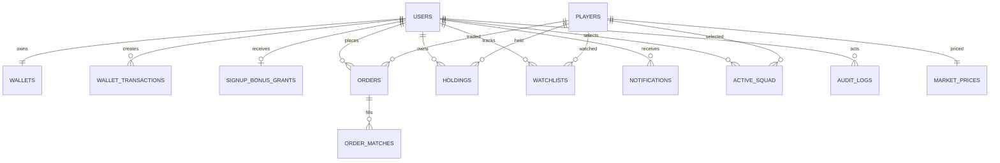

# Database flow

## Provider and connection

The API uses SQLAlchemy 2 with `backend/app/core/database.py`. Render supplies
a PostgreSQL connection string through `DATABASE_URL`; the settings adapter
converts `postgresql://` to `postgresql+psycopg://`. Local tests use a SQLite
file selected by `backend/tests/conftest.py`. Redis is optional infrastructure
and is not the financial source of truth.

Render's `backend/start.sh` applies `alembic upgrade head` before Uvicorn. The
FastAPI startup path intentionally does not call `create_all`; Alembic is the
single schema authority. Never run `supabase db reset` or destructive DDL
against the linked production database.

## Core schema

The application keeps profile fields on `users`; it does not create a second
profile table.

| Table | Purpose and important fields | Constraints/indexes |
| --- | --- | --- |
| `users` | Identity and compact profile: email, username, names, country, avatar URL, currency/preferences, account status, role, auth provider/provider ID, password hash, DOB/age flag, timestamps, signup-bonus timestamp | Unique/indexed email and username; unique/indexed `auth_provider_id`; indexed role |
| `wallets` | One current Gold/Silver balance per user | Unique `user_id`, foreign key to users |
| `wallet_transactions` | Append-only balance movements and signup/trade/test-credit reasons | Indexed user; unique optional idempotency key |
| `signup_bonus_grants` | One compact bonus grant record per user with Gold/Silver amounts, reason, key, timestamp | Unique `user_id` and idempotency key |
| `players` | Catalog identity: symbol, name, league, club, active flag | Unique/indexed symbol |
| `market_prices` | Current bid/ask and source metadata for a player | Unique player foreign key; updated timestamp |
| `orders` | User market order request, side, quantity, status, failure reason, idempotency key | Indexed user/player; unique optional idempotency key |
| `order_matches` | Execution quantity and price for an order | Indexed order foreign key |
| `holdings` | User/player quantity, average cost, realized P/L | Indexed user/player; unique `(user_id, player_id)` |
| `active_squad` | User/player squad slot and position | Indexed user; unique `(user_id, player_id)` and `(user_id, position)` |
| `watchlists` | User/player watch relationship and creation time | Indexed user/player; unique `(user_id, player_id)` |
| `notifications` | Small user-scoped kind/message/read record | Indexed user; bounded API reads |
| `audit_logs` | Administrator actor/target, action, compact JSON details, timestamp | Indexed actor, target, created time |

The historical sports tables created by `v2_bzzoiro_sports_data` are removed
by `v4_remove_live_notebook`. The repository does not use that notebook data
at runtime. There is no separate database table for charts, temporary UI
state, or the optional Market Engine cache.

## Relationships

Foreign keys use the default SQLAlchemy delete behavior; application code
does not cascade-delete financial records. A user deletion workflow is not
implemented, so operators must preserve transaction/audit history.

## Transactions and integrity

- Local registration flushes the user and wallet, grants the configured bonus,
  writes ledger rows, and commits once.
- Supabase synchronization creates the local user/wallet/bonus in one commit;
  unique provider/email/username errors roll back and are mapped to safe 409s.
- Bonus grants lock the wallet, use a deterministic user key, and are guarded
  by unique user/key constraints. Existing users are not retroactively paid.
- Market orders lock the current price, wallet, and holding rows where the
  database supports row locks; balance, holding, match, ledger, order, and
  notification changes commit together. Rejected orders are recorded with a
  failure reason.
- Admin status updates and catalog imports commit their data plus audit row in
  one transaction.

The API converts Decimal database values to numeric response values. Financial
settlement remains Decimal/SQL-side; frontend numbers are presentation only.

## Migration history

| Revision | Purpose |
| --- | --- |
| `v1_initial_trading` | Creates the initial users, wallets, catalog, prices, orders, holdings, squads, notifications, and related tables from SQLAlchemy metadata |
| `v2_bzzoiro_sports_data` | Historical provider/sports synchronization tables |
| `v3_user_profiles_bonus` | Adds compact profile fields, account status, preferences, timestamps, and bonus marker |
| `v4_remove_live_notebook` | Safely removes the obsolete sports/notebook tables; downgrade intentionally does not recreate historical data |
| `v5_watchlists` | Adds authenticated watchlists and uniqueness/indexes |
| `v6_user_admin_bonus_audit` | Adds roles, signup grant ledger, and audit logs |
| `v7_supabase_auth_identity` | Adds nullable unique Supabase provider identity mapping |
| `v8_market_price_source` | Adds source metadata for imported market prices |
| `v9_supabase_rls_guard` | Enables PostgreSQL RLS for direct Supabase API access; direct `anon`/`authenticated` access is deny-by-default while FastAPI remains the application authority |
| `v10_auth_provider` | Records `local`, `email`, or `google` provider classification without duplicating OAuth profile data |

Migrations are validated with `alembic upgrade head` and `alembic check` on a
safe test database. PostgreSQL-specific RLS statements are skipped on SQLite.
Because `v4` is destructive and its downgrade is intentionally a no-op, take
a database backup and rehearse upgrades before production rollout.

## Catalog and production data

Startup never inserts player, price, balance, activity, or chart fixtures.
Real catalog/price rows arrive through the admin-only
`POST /api/v1/admin/catalog/import` boundary, which validates at most 500
records, rejects duplicate symbols and invalid bid/ask relationships, upserts
players/prices, stores a source string, and writes an audit event. Automatic
Market Engine catalog/price synchronization is not available in the audited
external contract.

The test suite creates short-lived catalog fixtures in SQLite. Those fixtures
are isolated by test setup and are not part of the production startup path.

## Backup, rollback, and storage concerns

Render PostgreSQL backups, retention, point-in-time recovery, and restore
testing must be configured by the operator; this repository does not automate
them. Financial tables (`wallet_transactions`, `orders`, `order_matches`, and
holdings) must not be deleted for routine cleanup. Non-essential notification
retention, provider payload retention, and data archival are not implemented;
avoid writing high-volume debug or raw-provider payloads into this schema.

Before a migration, capture a backup and run `alembic upgrade head` against a
staging clone. To roll back a just-applied migration, use the reviewed Alembic
downgrade path only after confirming its data implications; do not reset the
production database.
